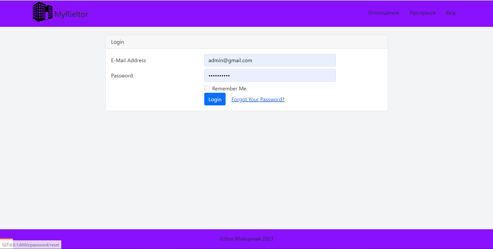
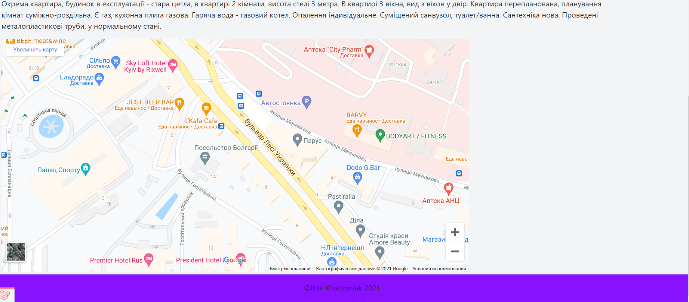

# Rietor company

### Basic autorize

### About us page

### Advirtisements page
### Used:
#### - pagination
#### - filters and sort
#### - bootstrap adaptive

### Advertise page
- in this part website used geogcoding

 

### Admin panel

### Options to start
- Admin will be first user who autorize in Rieltor.
- If you want to run seed, you need comment last line
- Аfter this run db:seed and comment two first line.
- Uncomment last line, run seed again.
